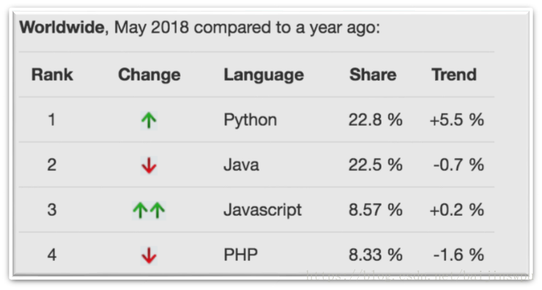
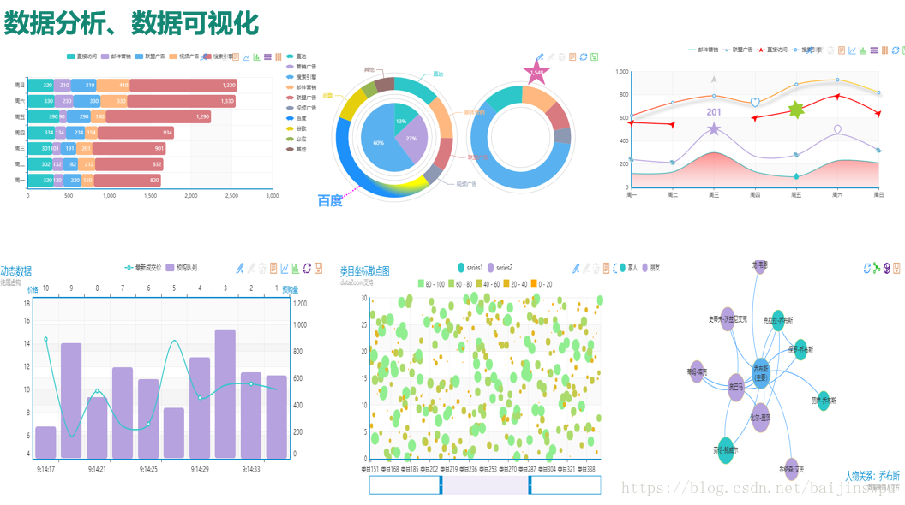
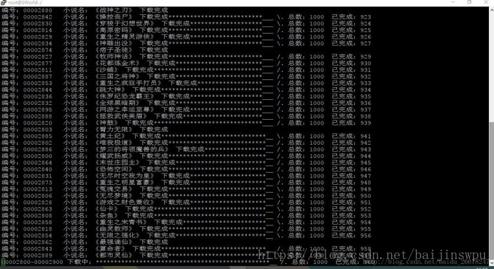
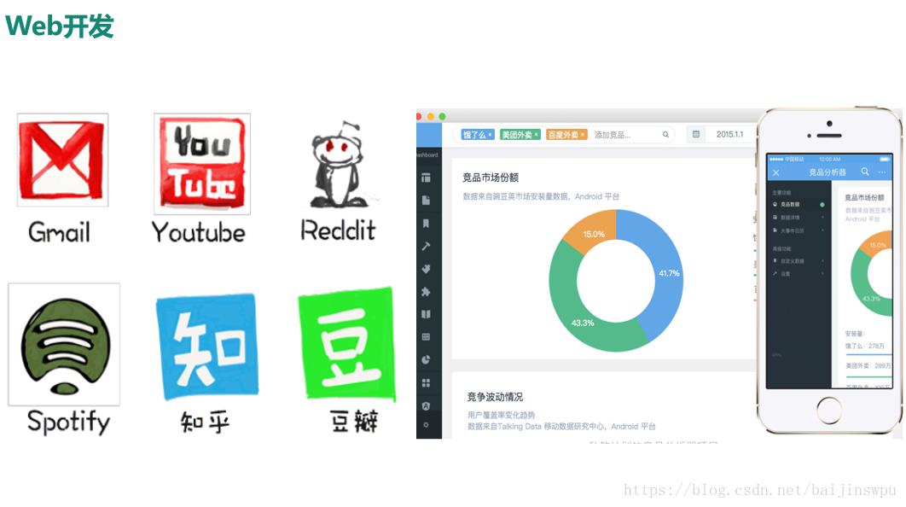

# 认识 Python

> 人生苦短，我用 Python —— Life is short, you need Python

## 目标

* Python 的起源
* 为什么要用 Python？
* Python 的特点
* Python 的优缺点
* Python 环境安装
## 01. Python 的起源

> Python 的创始人为吉多·范罗苏姆（Guido van Rossum）

1. 1989 年的圣诞节期间，吉多·范罗苏姆为了在阿姆斯特丹打发时间，决心开发一个新的**解释程序**，作为 ABC 语言的一种继承（**感觉下什么叫牛人**）
2. ABC 是由吉多参加设计的一种教学语言，就吉多本人看来，ABC 这种语言非常优美和强大，是**专门为非专业程序员设计的**。但是 ABC 语言并没有成功，究其原因，吉多认为是**非开放**造成的。吉多决心在 Python 中避免这一错误，并获取了非常好的效果
3. 之所以选中 Python（蟒蛇） 作为程序的名字，是因为他是 BBC 电视剧——蒙提·派森的飞行马戏团（Monty Python's Flying Circus）的爱好者
4. 1991 年，第一个 Python **解释器** 诞生，它是用 C 语言实现的，并能够调用 C 语言的库文件

### 1.1 解释器（科普）

**计算机不能直接理解任何除机器语言以外的语言**，所以必须要把程序员所写的程序语言翻译成机器语言，计算机才能执行程序。**将其他语言翻译成机器语言的工具，被称为编译器**

编译器翻译的方式有两种：一个是**编译**，另外一个是**解释**。两种方式之间的区别在于**翻译时间点的不同**。当编译器**以解释方式运行的时候**，也称之为**解释器**

* **编译型语言**：程序在执行之前需要一个专门的编译过程，把程序编译成为机器语言的文件，运行时不需要重新翻译，直接使用编译的结果就行了。程序执行效率高，依赖编译器，跨平台性差些。如 C、C++
* **解释型语言**：解释型语言编写的程序不进行预先编译，以文本方式存储程序代码，会将代码一句一句直接运行。在发布程序时，看起来省了道编译工序，但是在运行程序的时候，必须先解释再运行

#### 编译型语言和解释型语言对比

* **速度** —— 编译型语言比解释型语言执行速度快
* **跨平台性** —— 解释型语言比编译型语言跨平台性好

### 1.2 Python 的设计目标

1999 年，吉多·范罗苏姆向 DARPA 提交了一条名为 “Computer Programming for Everybody” 的资金申请，并在后来说明了他对 Python 的目标：

* 一门**简单直观的语言**并与主要竞争者一样强大
* **开源**，以便任何人都可以为它做贡献
* 代码**像纯英语那样容易理解**
* 适用于**短期**开发的日常任务

这些想法中的基本都已经成为现实，Python 已经成为一门流行的编程语言

### 1.3 Python 的设计哲学

1. 优雅
2. 明确
3. 简单

<!-- > 在 Python 解释器内运行 `import this` 可以获得完整的列表 -->

* Python 开发者的哲学是：**用一种方法，最好是只有一种方法来做一件事**
* 如果面临多种选择，Python 开发者一般会拒绝花俏的语法，而选择**明确没有或者很少有歧义的语法**

## 02. 为什么选择 Python？
* 以下新闻摘录自互联网：
    * 1、Python将纳入浙江省高考！从 2018 年起浙江省信息技术教材编程语言将会更换为 Python。 
    * 2、Python纳入山东省的小学教材课程，小学生都开始接触 Python 语言了。 
    * 3、Python 将加入全国计算机等级考试！教育部考试中心决定自2018年起，在计算机二级考试加入了“Python语言程序设计”科目。 
* 苹果的siri、Google的阿尔法狗、百度、阿里、小米等互联网巨头的各种智能音箱，都标志着人工智能时代已经来临，而AI的核心就是深度学习算法，
用Python实现这些算法是最好不过的。**因此，人工智能火爆的背后必然会引起python的流行。**

> 同一个问题，用不同的语言解决，代码量差距还是很多的，一般情况下 `Python` 是 `Java` 的 **1/5**，所以说 **人生苦短，我用 Python**

## 03. Python 特点

* Python 是**完全面向对象的语言**
    * **函数**、**模块**、**数字**、**字符串**都是对象，**在 Python 中一切皆对象**
    * 完全支持继承、重载、多重继承
    * 支持重载运算符，也支持泛型设计
* Python **拥有一个强大的标准库**，Python 语言的核心只包含 **数字**、**字符串**、**列表**、**字典**、**文件** 等常见类型和函数，而由 Python 标准库提供了 **系统管理**、**网络通信**、**文本处理**、**数据库接口**、**图形系统**、**XML 处理** 等额外的功能
* Python 社区提供了**大量的第三方模块**，使用方式与标准库类似。它们的功能覆盖 **科学计算**、**人工智能**、**机器学习**、**Web 开发**、**数据库接口**、**图形系统** 多个领域

> Python具体可以做什么？
* 1、首先，最基本的功能就是借助python中自带的科学计算包Numpy、Pandas、Matplotlib等，完成复杂的数据分析。

* 2、网络爬虫，利用python可以从网络上爬取任何格式的数据，比如文本数据、音频、视频数据、图片等。

* 3、词云图，利用python对语料集分词处理后，输出个性化词云图。

* 4、web开发，当然python之所以强大，是因为它的工程级开发，完全可以实现网站开发

### 面向对象的思维方式

* **面向对象** 是一种 **思维方式**，也是一门 **程序设计技术**
* 要解决一个问题前，首先考虑 **由谁** 来做，怎么做事情是 **谁** 的职责，最后把事情做好就行！
    * **对象** 就是 **谁**
* 要解决复杂的问题，就可以找**多个不同的对象**，**各司其职**，共同实现，最终完成需求

## 04. Python 的优缺点

### 4.1 优点

* 简单、易学
* 免费、开源
* **面向对象**
* 丰富的库
* 可扩展性
    * 如果需要一段关键代码运行得更快或者希望某些算法不公开，可以把这部分程序用 `C` 或 `C++` 编写，然后在 `Python` 程序中使用它们
* ……

### 4.2 缺点

* 运行速度（有速度要求的话，用C++改写关键部分吧。）
* 国内市场较小（国内以python来做主要开发的，目前只有一些web2.0公司）。但时间推移，目前很多国内软件公司，尤其是游戏公司，也开始规模使用他。
* 中文资料匮乏（好的python中文资料屈指可数）。托社区的福，有几本优秀的教材已经被翻译了，但入门级教材多，高级内容还是只能看英语版。

## 05. Python 环境安装

> 安装包共享地址：\\\10.10.5.88\新文件中转站\袁秀晗\python安装包

